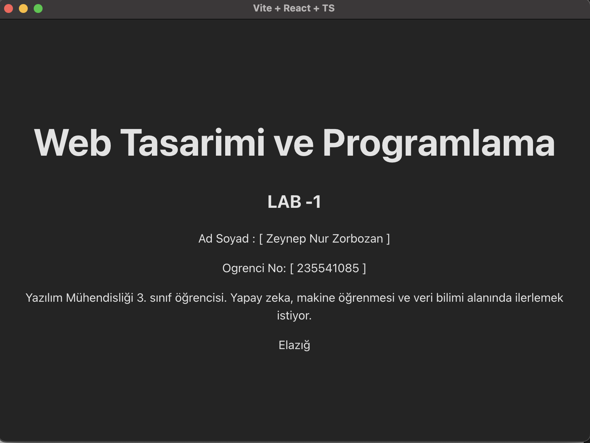

# Web LAB -1 - Hello Project

4 Bu proje , Web Tasarimi ve Programlama dersi LAB -1 kapsaminda
5 Vite + React + TypeScript kullanilarak olusturulmustur .
8 - ** Ad Soyad :** [ Kendi Adin ]
9 - ** Ogrenci No :** [ Numaran ]

## Kullanilan Teknolojiler

- React 18
- TypeScript
- Vite
  2
  3 ## Hakkinda
  6
  7 ## Gelistirici
  10
  11 12 13 14 15
  16 17 18 19`
20
21 22 23 25 24`
  26
  27 28 ## Kurulum

````bash
npm install
## Calistirma
```bash
npm run dev
Tarayicida http :// localhost :5173 adresini ac.
## Ekran Goruntusu

````
